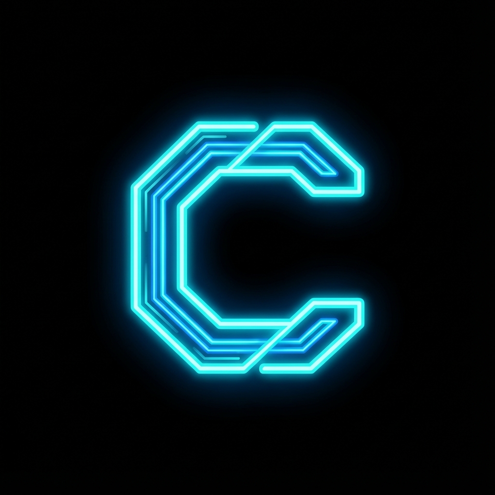

# 🌌 Calmizir - Architect & Developer Portfolio

> "A futuristic, immersive portfolio experience built for the modern web."

**Calmizir** is a high-performance personal portfolio website designed with a "Deep Space / Cyberpunk" aesthetic. It features a custom window management system, immersive audio experience, and a sci-fi inspired UI that feels like interacting with a futuristic terminal.

 
*(Please allow the System Loader to initialize for the full experience)*

## ✨ Key Features

### 🖥️ Immersive UI/UX
- **Deep Space Theme**: A polished dark mode aesthetic using midnight blues, neon cyans, and glassmorphism effects.
- **Glitch & Reveal Animations**: Dramatic entry transitions and system boot sequences that mimic sci-fi interfaces.
- **Custom Window System**: A desktop-like experience within the browser, allowing multiple "apps" (Bio, Portfolio, Contact) to open in draggable, closable windows.
- **Responsive Design**: Fully optimized for mobile devices with a custom touch-friendly navigation menu.

### 🎵 Intelligent Audio System
- **Background Ambiance**: Loops "Cyberpunk Odyssey" for deep immersion.
- **Smart Autoplay**: Includes a "System Initialize" interaction step to comply with browser autoplay policies while maintaining immersion.
- **Audio Visualizer**: Real-time CSS-based spectrum analyzer animation.
- **Persistence**: Remembers your Mute/Unmute preference across sessions via LocalStorage.

### 🛠️ Tech Stack
- **Framework**: [Vue 3](https://vuejs.org/) (Composition API, `<script setup>`)
- **Build Tool**: [Vite](https://vitejs.dev/)
- **Styling**: Vanilla CSS with comprehensive CSS Variables (Theming).
- **Backend (WIP)**: Cloudflare Pages Functions (Serverless) + D1 Database for CMS.
- **Deployment**: Cloudflare Pages.

## 🚀 Getting Started

### Prerequisites
- Node.js (v16+)
- npm

### Installation

1. **Clone the repository**
   ```bash
   git clone https://github.com/Calmizir/landing-calmizir.git
   cd landing-calmizir
   ```

2. **Install dependencies**
   ```bash
   npm install
   ```

3. **Run Development Server**
   ```bash
   npm run dev
   ```

4. **Build for Production**
   ```bash
   npm run build
   ```

## 📂 Project Structure

- `src/components/HUD`: Core UI components (MainHUD, MobileNav).
- `src/components/UI`: Reusable UI elements (Windows, Loaders, Glitch effects).
- `src/views`: Content pages (About, Portfolio, Contact).
- `src/composables`: Shared logic (Audio, WindowManager, Parallax).
- `src/style.css`: Global theme variables and utility classes.

## 🔮 Future Roadmap (CMS)
- [ ] Admin Login Portal
- [ ] Real-time Project Management (CRUD)
- [ ] Dual-language support (ES/EN) via Admin Panel

---

*Architected by **Joel Fereira** (Calmizir).*
*System Status: ONLINE* 🟢
